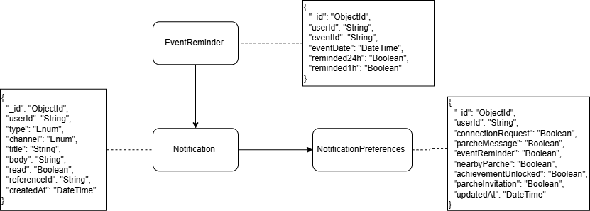
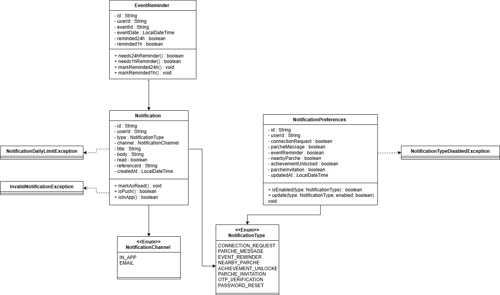
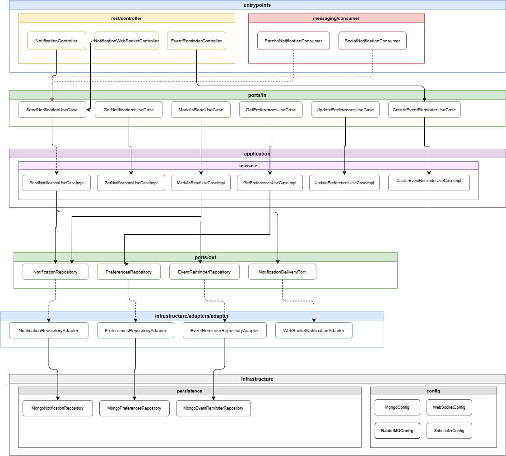

<div align="center">

# 🔔 PATRICI.A — Microservicio de Notificaciones


> 💡 **PATRICI.A** es un proyecto académico de la Escuela Colombiana de Ingeniería Julio Garavito, construido con arquitectura de microservicios orientada a producción.

</div>

---

## 📑 Tabla de Contenidos

1. [👤 Integrantes](#1--integrantes)
2. [⚙️ Tecnologías Utilizadas](#2--tecnologías-utilizadas)
3. [🎯 Descripción del Módulo](#3--descripción-del-módulo)
4. [🏗️ Cómo Funciona el Módulo](#4--cómo-funciona-el-módulo)
5. [📊 Diagramas](#5--diagramas)
   - [5.1 Diagrama de Datos](#51-diagrama-de-datos--modelo-mongodb)
   - [5.2 Diagrama de Clases](#52-diagrama-de-clases)
   - [5.3 Diagrama de Componentes](#53-diagrama-de-componentes)
6. [🧩 Funcionalidades](#6--funcionalidades)
   - [Endpoints REST](#endpoints-rest)
   - [Colas de Mensajería (RabbitMQ)](#colas-de-mensajería-rabbitmq)
   - [WebSocket](#-websocket--notificaciones-en-tiempo-real)
7. [🧪 Evidencia de Pruebas Unitarias](#7--evidencia-de-pruebas-unitarias)
8. [📈 Evidencia de Cobertura](#8--evidencia-del-análisis-de-cobertura)
9. [🚀 Cómo Ejecutar el Proyecto](#9--cómo-ejecutar-el-proyecto)
10. [🔄 Evidencia CI/CD](#10--evidencia-del-despliegue-cicd)
11. [🌐 Link Expuesto en Azure/AWS con Swagger](#11--link-expuesto-en-azureaws-con-swagger)
12. [🗂️ Organización del Código](#12--organización-del-código)
13. [📝 Código Documentado](#13--código-documentado)
14. [🔗 Conexiones con Servicios Externos](#14--conexiones-con-servicios-externos)
15. [⚙️ Pipeline de Desarrollo](#15--pipeline-de-desarrollo)
16. [🚢 Pipeline de PROD](#16--pipeline-de-prod)

---

## 1. 👤 Integrantes

| Nombre | correo                                     |
|---|--------------------------------------------|
| Cristian Guerrero | cristian.guerrero-b@mail.escuelaing.edu.co |
| Santiago Cajamarca | david.cajamarca-c@mail.escuelaing.edu.co   |
| Nicolas Sanchez | nicolas.sanchez-g@mail.escuelaing.edu.co   |
| Daniel Rodriguez | daniel.rsuarez@mail.escuelaing.edu.co      |

El equipo **Squirtle Squad** aplicó la metodología **Scrum** con sprints semanales, usando **Jira** para seguimiento de tareas y **GitHub Projects** como tablero de trabajo.

---

## 2. ⚙️ Tecnologías Utilizadas

| Tecnología / Herramienta | Uso principal en el proyecto |
|---|---|
| **Java 21** | Lenguaje principal de desarrollo |
| **Spring Boot 3.3.0** | Framework principal del backend — gestión de dependencias y ciclo de vida de la aplicación |
| **Spring Security** | Autenticación y autorización mediante JWT |
| **Spring WebSocket + STOMP** | Canal de entrega de notificaciones en tiempo real al usuario conectado |
| **Spring AMQP / RabbitMQ** | Broker de mensajería asíncrona para consumo de eventos de otros módulos |
| **Spring Data MongoDB** | Persistencia de notificaciones, preferencias y recordatorios |
| **MongoDB Atlas** | Base de datos NoSQL en la nube — colecciones `notifications`, `notificationPreferences`, `eventReminders` |
| **Spring Mail (JavaMailSender)** | Envío de notificaciones transaccionales por correo electrónico |
| **OpenFeign** | Comunicación sincrónica con módulos externos cuando se requiere |
| **Lombok** | Reducción de código repetitivo con `@Builder`, `@Getter`, `@RequiredArgsConstructor` |
| **SpringDoc OpenAPI 2.5.0** | Generación automática de documentación Swagger UI |
| **JUnit 5 + Mockito** | Pruebas unitarias e integración con mocking de puertos y dependencias |
| **JaCoCo** | Reportes de cobertura de código |
| **Apache Maven 3.9** | Herramienta de construcción y gestión de dependencias |
| **Docker + Docker Compose** | Contenedorización del servicio y orquestación local con RabbitMQ y MongoDB |
| **GitHub Actions** | Pipeline de integración continua (build y pruebas automáticas) |

---

## 3. 🎯 Descripción del Módulo

El microservicio de Notificaciones es el componente central del sistema PATRICI.A responsable de orquestar el flujo 
completo de alertas y recordatorios de la plataforma. Opera como un sistema reactivo orientado a eventos: consume señales 
de los demás módulos del ecosistema (parches, social) y las transforma en notificaciones dirigidas al usuario correcto, 
en el canal correcto y en el momento correcto. Su diseño garantiza que ningún evento relevante se pierda — si el usuario 
está conectado, lo recibe en tiempo real vía WebSocket; si no, la notificación queda persistida y disponible para cuando regrese. Más allá de la entrega, el módulo también gestiona las preferencias individuales de cada usuario y ejecuta recordatorios automáticos de eventos, posicionándose como la capa de comunicación activa entre la plataforma y sus usuarios.
### Funcionalidades Principales

| 💡 Funcionalidad | Descripción |
|---|---|
| **Entrega en Tiempo Real** | Entrega notificaciones instantáneas al usuario conectado mediante WebSocket STOMP sobre el topic `/topic/notifications/{userId}`. |
| **Persistencia In-App** | Persiste todas las notificaciones en MongoDB para que el usuario pueda consultarlas aunque no estuviera conectado en el momento de la generación. |
| **Gestión de Preferencias** | Permite a cada usuario habilitar o deshabilitar tipos de notificación de forma individual según sus preferencias. |
| **Recordatorios Automáticos** | Un scheduler evalúa eventos guardados cada 10 minutos y envía recordatorios automáticos a las 24h y a la 1h antes del inicio del evento. |
| **Consumo de Eventos Asíncrono** | Consume eventos de otros módulos (parches, social) vía RabbitMQ sin acoplamiento sincrónico con los productores. |

---

## 4. 🏗️ Cómo Funciona el Módulo

### Modelo Orientado a Eventos

El servicio opera bajo un **modelo orientado a eventos**, consumiendo eventos publicados por otros módulos del sistema mediante colas de mensajería **RabbitMQ con topología de Topic Exchange**, lo que lo desacopla completamente de los módulos productores.

- Cuando el usuario **está conectado**, las notificaciones se entregan en tiempo real vía **WebSocket (STOMP)**.
- Cuando el usuario **no está conectado**, quedan persistidas en **MongoDB** para su consulta posterior (modelo in-app).

### Módulos con los que se integra

| Módulo Productor | Tipo de Integración | Evento que produce |
|---|---|---|
| **Módulo de Parches** | RabbitMQ (asíncrono) | Invitación a parche, parche cercano |
| **Módulo Social** | RabbitMQ (asíncrono) | Solicitud de conexión |
| **Módulos externos** | OpenFeign (sincrónico) | Consultas puntuales cuando se requiere |

### Patrones Utilizados

| Patrón | Descripción |
|---|---|
| **Ports & Adapters (Hexagonal)** | El dominio define interfaces (puertos); la infraestructura provee implementaciones (adaptadores) |
| **Event-Driven** | El servicio reacciona a eventos publicados en RabbitMQ sin acoplamiento con los productores |
| **Repository Pattern** | Abstracción de persistencia mediante interfaces de repositorio en el dominio |
| **DTO Pattern** | Objetos de transferencia de datos para desacoplar la API del dominio interno |
| **Scheduler Pattern** | Job periódico cada 10 minutos para evaluación y envío de recordatorios de eventos |

### Estilo de Arquitectura Detallado

El microservicio implementa **Arquitectura Hexagonal (Ports & Adapters)** combinada con principios de **Clean Architecture**, organizada en cuatro capas:

```
┌──────────────────────────────────────────────────────────────┐
│  ENTRYPOINTS (Puertos de Entrada)                            │
│  REST Controllers · RabbitMQ Consumers · WebSocket           │
├──────────────────────────────────────────────────────────────┤
│  APPLICATION (Casos de Uso)                                  │
│  SendNotification · GetNotifications · MarkAsRead            │
│  ManagePreferences · CreateEventReminder · EventReminderSvc  │
├──────────────────────────────────────────────────────────────┤
│  DOMAIN (Núcleo — sin dependencias externas)                 │
│  Entities · Enums · Ports/In · Ports/Out · Exceptions        │
├──────────────────────────────────────────────────────────────┤
│  INFRASTRUCTURE (Adaptadores de Salida)                      │
│  MongoDB Repos · WebSocket Adapter · Email Adapter           │
│  RabbitMQ Config · WebSocket Config · Spring Config          │
└──────────────────────────────────────────────────────────────┘
```

**Principios aplicados:**

| Principio | Implementación |
|---|---|
| **Separación de responsabilidades** | Cada capa tiene un propósito único y bien definido |
| **Inversión de dependencias** | Las capas externas dependen de interfaces definidas en el dominio |
| **Independencia del framework** | La lógica de negocio no depende de Spring, MongoDB ni RabbitMQ |
| **Desacoplamiento por eventos** | Los módulos productores no conocen al notification-service |
| **Testabilidad** | Fácil crear pruebas unitarias mockeando puertos y adaptadores |

---

## 5. 📊 Diagramas

### 5.1 Diagrama de Datos — Modelo MongoDB

El servicio utiliza tres colecciones independientes en MongoDB Atlas:



#### Colección `notifications`

| Campo | Tipo | Descripción |
|---|---|---|
| _id | ObjectId | ID generado por MongoDB |
| userId | String | Usuario destino |
| type | Enum | Tipo de notificación |
| channel | Enum | `IN_APP` / `EMAIL` |
| title | String | Título visible |
| body | String | Cuerpo del mensaje |
| read | Boolean | Estado de lectura |
| referenceId | String | Recurso relacionado (opcional) |
| createdAt | DateTime | Fecha de creación |

#### Colección `notificationPreferences`

| Campo | Tipo | Descripción |
|---|---|---|
| userId | String | Usuario propietario |
| connectionRequest | Boolean | Recibir alertas de solicitudes de conexión |
| parcheMessage | Boolean | Recibir alertas de mensajes en parches |
| eventReminder | Boolean | Recibir recordatorios de eventos |
| nearbyParche | Boolean | Recibir alertas de parches cercanos |
| achievementUnlocked | Boolean | Recibir alertas de logros |
| parcheInvitation | Boolean | Recibir invitaciones a parches |
| updatedAt | DateTime | Última actualización |

#### Colección `eventReminders`

| Campo | Tipo | Descripción |
|---|---|---|
| userId | String | Usuario que guardó el evento |
| eventId | String | Identificador del evento |
| eventDate | DateTime | Fecha del evento |
| reminded24h | Boolean | Si ya se envió el recordatorio de 24h |
| reminded1h | Boolean | Si ya se envió el recordatorio de 1h |

---

### 5.2 Diagrama de Clases



---

### 5.3 Diagrama de Componentes



- **Entrypoints:** `NotificationController`, `EventReminderController`, `NotificationWebSocketController` (REST) y `ParcheNotificationConsumer`, `SocialNotificationConsumer` (RabbitMQ).
- **Puertos de entrada (ports/in):** Interfaces que definen los casos de uso del dominio.
- **Casos de uso (application):** Implementaciones que orquestan la lógica, verifican preferencias y despachan por canal.
- **Puertos de salida (ports/out):** `NotificationRepository`, `PreferencesRepository`, `EventReminderRepository`, `NotificationDeliveryPort`.
- **Adaptadores:** Implementaciones MongoDB y WebSocket/Email de los puertos de salida.

---

## 6. 🧩 Funcionalidades

### Endpoints REST

---

#### 1️⃣ Enviar Notificación

Crea y entrega una notificación a un usuario. Si el usuario está conectado vía WebSocket la recibe en tiempo real; si no, queda persistida en MongoDB.

**Endpoint:** `POST /api/notifications`

**Request Body:**

| Campo | Tipo | Restricciones | Descripción |
|---|---|---|---|
| userId | String | Obligatorio | Identificador del usuario destino |
| type | Enum | Obligatorio | Tipo de notificación (ver tipos disponibles) |
| title | String | Obligatorio | Título visible de la notificación |
| body | String | Obligatorio | Cuerpo del mensaje |
| referenceId | String | Opcional | ID del recurso que originó la notificación |

**Response Body:**

| Campo | Tipo | Descripción |
|---|---|---|
| id | String | Identificador único de la notificación |
| userId | String | Usuario al que pertenece |
| type | Enum | Tipo de notificación |
| channel | Enum | Canal de entrega: `IN_APP` o `EMAIL` |
| title | String | Título de la notificación |
| body | String | Cuerpo del mensaje |
| read | Boolean | Indica si fue leída |
| referenceId | String | ID del recurso relacionado |
| createdAt | DateTime | Fecha y hora de creación |

**Ejemplo:**

```json
// POST /api/notifications
// Request
{
  "userId": "user-123",
  "type": "PARCHE_INVITATION",
  "title": "Te invitaron a un parche",
  "body": "Santiago te invitó a: Parche de cálculo",
  "referenceId": "parche-456"
}

// Response 201 CREATED
{
  "id": "6650a1f3e4b0c12d3a4f5678",
  "userId": "user-123",
  "type": "PARCHE_INVITATION",
  "channel": "IN_APP",
  "title": "Te invitaron a un parche",
  "body": "Santiago te invitó a: Parche de cálculo",
  "read": false,
  "referenceId": "parche-456",
  "createdAt": "2026-04-15T10:30:00"
}
```

**Caso de exito:**
1. El sistema valida que `userId`, `type` y `body` no estén vacíos.
2. Se consultan las preferencias del usuario. Si el tipo está deshabilitado, se rechaza.
3. Se determina el canal (`IN_APP` si el userId no contiene `@`, `EMAIL` si sí).
4. La notificación se persiste en MongoDB.
5. Se entrega via el adaptador correspondiente al canal.
6. Se retorna `201 CREATED` con la notificación creada.

**Casos de errores:**

| Código HTTP | Escenario | Mensaje |
|---|---|---|
| 400 | Campos obligatorios vacíos | `"el campo userId es obligatorio"` |
| 409 | Tipo deshabilitado en preferencias | `"El tipo de notificación NEARBY_PARCHE está deshabilitado para el usuario user-123."` |
| 500 | Error de persistencia | Error genérico del servidor |

---

#### 2️⃣ Listar Notificaciones del Usuario

Retorna las notificaciones del usuario autenticado de forma paginada, ordenadas por fecha descendente.

**Endpoint:** `GET /api/notifications`

**Headers:** `X-User-Id: {userId}`

**Query Params:**

| Parámetro | Tipo | Default | Descripción |
|---|---|---|---|
| page | int | 0 | Número de página (base 0) |
| size | int | 20 | Tamaño de página |

**Response:** `200 OK` — `List<NotificationResponse>` (misma estructura que POST /api/notifications)

**Errores:**

| Código HTTP | Escenario |
|---|---|
| 400 | Header `X-User-Id` ausente o parámetros inválidos |

---

#### 3️⃣ Contar Notificaciones No Leídas

Retorna el número de notificaciones no leídas del usuario.

**Endpoint:** `GET /api/notifications/unread/count`

**Headers:** `X-User-Id: {userId}`

**Response:**
```json
{ "count": 5 }
```

---

#### 4️⃣ Marcar Notificación como Leída

Marca una notificación específica del usuario como leída.

**Endpoint:** `PUT /api/notifications/{notificationId}/read`

**Headers:** `X-User-Id: {userId}`

**Response:** `204 No Content`

**Errores:**

| Código HTTP | Escenario |
|---|---|
| 404 | Notificación no encontrada o no pertenece al usuario |

---

#### 5️⃣ Marcar Todas como Leídas

Marca todas las notificaciones del usuario como leídas en una sola operación.

**Endpoint:** `PUT /api/notifications/read`

**Headers:** `X-User-Id: {userId}`

**Response:** `204 No Content`

---

#### 6️⃣ Consultar Preferencias de Notificación

Retorna las preferencias de notificación del usuario. Si no existen registros previos, devuelve los valores por defecto.

**Endpoint:** `GET /api/notifications/preferences`

**Headers:** `X-User-Id: {userId}`

**Response:**
```json
{
  "connectionRequest": true,
  "parcheMessage": true,
  "eventReminder": true,
  "nearbyParche": false,
  "achievementUnlocked": true,
  "parcheInvitation": true
}
```

---

#### 7️⃣ Actualizar Preferencia de Notificación

Habilita o deshabilita un tipo de notificación específico para el usuario.

**Endpoint:** `PUT /api/notifications/preferences`

**Headers:** `X-User-Id: {userId}`

**Request Body:**
```json
{ "type": "NEARBY_PARCHE", "enabled": true }
```

**Response:** `200 OK` con el objeto `NotificationPreferencesResponse` actualizado.

**Errores:**

| Código HTTP | Escenario |
|---|---|
| 400 | Tipo de notificación inválido o campo `enabled` ausente |

---

#### 8️⃣ Crear Recordatorio de Evento

Registra un recordatorio para un evento guardado. El scheduler enviará notificaciones automáticas **24 horas** y **1 hora** antes del inicio del evento.

**Endpoint:** `POST /api/event-reminders`

**Request Body:**
```json
{
  "userId": "user-123",
  "eventId": "event-789",
  "eventDate": "2026-05-10T14:00:00"
}
```

**Response:** `201 CREATED`
```json
{
  "id": "reminder-001",
  "userId": "user-123",
  "eventId": "event-789",
  "eventDate": "2026-05-10T14:00:00",
  "reminded24h": false,
  "reminded1h": false
}
```

**Errores:**

| Código HTTP | Escenario |
|---|---|
| 400 | Fecha en el pasado o campos obligatorios ausentes |

---

### Colas de Mensajería (RabbitMQ)

El servicio actúa como **consumidor** en la arquitectura de mensajería del sistema. Los otros módulos publican eventos y este servicio los transforma en notificaciones.

| Consumer | Exchange | Cola | Routing Key | Evento | Payload esperado |
|---|---|---|---|---|---|
| `ParcheNotificationConsumer` | `parche.exchange` | `parche.invitation.queue` | `parche.invitation` | Invitación a parche | `{ userId, parcheId, inviterName, parcheName }` |
| `ParcheNotificationConsumer` | `parche.exchange` | `parche.nearby.queue` | `parche.nearby` | Parche cercano | `{ userId, parcheId, parcheName, distance }` |
| `SocialNotificationConsumer` | `social.exchange` | `social.connection.queue` | `social.connection` | Solicitud de conexión | `{ userId, requesterId, requesterName }` |

> ⚠️ **Nota:** Completar el payload exacto de cada evento una vez estén definidos los contratos con los módulos productores.

---

### 🔌 WebSocket — Notificaciones en Tiempo Real

La conexión WebSocket se realiza mediante **STOMP sobre SockJS**.

| Campo | Valor |
|---|---|
| **Endpoint de conexión** | `/ws/notifications` |
| **Topic de suscripción** | `/topic/notifications/{userId}` |
| **Prefijo de aplicación** | `/app` |

**Ejemplo de suscripción (JavaScript):**
```javascript
const socket = new SockJS('/ws/notifications');
const stompClient = Stomp.over(socket);

stompClient.connect({}, () => {
  stompClient.subscribe(`/topic/notifications/${userId}`, (message) => {
    const notification = JSON.parse(message.body);
    console.log('Nueva notificación:', notification);
  });
});
```

---

### ⚠️ Manejo de Errores

El servicio implementa un **handler centralizado** con `@RestControllerAdvice` en la capa `entrypoints/advice`.

| Código HTTP | Tipo | Escenario |
|---|---|---|
| 400 | `InvalidNotificationException` | Campos obligatorios ausentes (`userId`, `type`, `body`) |
| 400 | `MethodArgumentNotValidException` | Validaciones de DTOs fallidas |
| 404 | `NotificationNotFoundException` | Notificación no encontrada o no pertenece al usuario |
| 409 | `NotificationTypeDisabledException` | El tipo de notificación está deshabilitado en las preferencias del usuario |
| 500 | `Exception` (genérico) | Error inesperado del servidor |

**Estructura del response de error:**
```json
{
  "status": 404,
  "message": "Notification not found for id: 6650a1f3e4b0c12d3a4f5678",
  "timestamp": "2026-04-15T10:30:00"
}
```

---

## 7. 🧪 Evidencia de Pruebas Unitarias

### Tipos de pruebas implementadas

| Tipo | Descripción | Herramientas |
|---|---|---|
| **Pruebas Unitarias** | Validan el funcionamiento aislado de cada caso de uso mockeando puertos y dependencias | JUnit 5 + Mockito |

### Clases de prueba

| Clase | Casos cubiertos |
|---|---|
| `SendNotificationUseCaseImplTest` | Envío exitoso, campos vacíos, tipo deshabilitado |
| `GetNotificationsUseCaseImplTest` | Paginación y consulta por usuario |
| `GetUnreadCountUseCaseImplTest` | Conteo de no leídas |
| `MarkAsReadUseCaseImplTest` | Marcar una y todas como leídas |
| `NotificationMapperTest` | Transformaciones entre dominio y DTOs |

### Cómo ejecutar las pruebas

```bash
# Ejecutar todas las pruebas
mvn clean test

# Ejecutar una prueba específica
mvn test -Dtest=SendNotificationUseCaseImplTest
```

### Criterios de aceptación

- ✅ Cobertura mínima del **80%** en servicios y casos de uso
- ✅ Todas las pruebas en estado **PASSED**
- ✅ Pruebas de casos felices **y** casos de error implementados

> ⚠️ **Pendiente:** Agregar capturas de pantalla o reporte de ejecución de pruebas (resultado del `mvn test`).

---

## 8. 📈 Evidencia del Análisis de Cobertura

Las métricas de cobertura se generan con **JaCoCo**.

```bash
# Generar reporte de cobertura JaCoCo
mvn clean test jacoco:report
```

El reporte HTML estará disponible en: `target/site/jacoco/index.html`

> ⚠️ **Pendiente:** Agregar captura de pantalla del reporte JaCoCo mostrando el porcentaje de cobertura alcanzado.

---

## 9. 🚀 Cómo Ejecutar el Proyecto

### Prerrequisitos

- **Java 21**
- **Maven 3.9+**
- **Docker** (recomendado para levantar RabbitMQ y MongoDB localmente)

### Opción 1: Ejecución Local (Maven)

```bash
# 1. Clonar repositorio
git clone https://github.com/tu-org/squirtle-squad-notification-service.git

# 2. Levantar dependencias (RabbitMQ + MongoDB) con Docker Compose
docker-compose up -d rabbitmq mongodb

# 3. Ejecutar la aplicación
mvn spring-boot:run
```

📍 **URL Local:** `http://localhost:8082`
📚 **Swagger UI:** `http://localhost:8082/swagger-ui.html`
📡 **WebSocket:** `ws://localhost:8082/ws/notifications`

### Opción 2: Ejecución completa con Docker

```bash
docker-compose up --build -d
```

### Variables de Entorno

| Variable | Descripción | Default |
|---|---|---|
| `SPRING_DATA_MONGODB_URI` | URI de conexión a MongoDB Atlas | Configurado en `application.properties` |
| `SPRING_RABBITMQ_HOST` | Host del broker RabbitMQ | `localhost` |
| `SPRING_RABBITMQ_PORT` | Puerto RabbitMQ | `5672` |
| `SERVER_PORT` | Puerto del servicio | `8082` |

---

## 10. 🔄 Evidencia del Despliegue CI/CD

El proyecto cuenta con un pipeline de **GitHub Actions** que se ejecuta automáticamente en cada push y pull request.

> ⚠️ **Pendiente:** Agregar capturas de pantalla o badges del pipeline de GitHub Actions mostrando el estado del build (verde/rojo), resultados de pruebas y despliegue.

---

## 11. 🌐 Link Expuesto en Azure/AWS con Swagger

> ⚠️ **Pendiente:** Agregar el link público del servicio desplegado en Azure/AWS junto con la URL de Swagger UI del entorno de producción.

Ejemplo esperado:
- **API Base URL:** `https://<dominio>/api`
- **Swagger UI:** `https://<dominio>/swagger-ui.html`

---

## 12. 🗂️ Organización del Código

El microservicio sigue **Arquitectura Hexagonal (Ports & Adapters)** con Clean Architecture.

```
squirtle-squad-notification-service/
│
├── 📁 src/
│   ├── 📁 main/
│   │   ├── 📁 java/com/patricia/notification/
│   │   │   │
│   │   │   ├── 📁 domain/                          # 🟢 DOMINIO (sin dependencias externas)
│   │   │   │   ├── 📁 model/                       # Entidades: Notification, NotificationPreferences, EventReminder
│   │   │   │   │   └── 📁 enums/                   # NotificationType, NotificationChannel
│   │   │   │   ├── 📁 ports/
│   │   │   │   │   ├── 📁 in/                      # Interfaces de casos de uso (puertos de entrada)
│   │   │   │   │   └── 📁 out/                     # Interfaces de repositorios y entrega (puertos de salida)
│   │   │   │   └── 📁 exceptions/                  # Excepciones de dominio
│   │   │   │
│   │   │   ├── 📁 application/                     # 🔵 APLICACIÓN
│   │   │   │   ├── 📁 usecase/                     # Implementaciones de los casos de uso
│   │   │   │   ├── 📁 service/                     # EventReminderService (scheduler)
│   │   │   │   ├── 📁 dto/
│   │   │   │   │   ├── 📁 request/                 # DTOs de entrada
│   │   │   │   │   └── 📁 response/                # DTOs de salida
│   │   │   │   └── 📁 mapper/                      # NotificationMapper
│   │   │   │
│   │   │   ├── 📁 entrypoints/                     # 🟠 PUERTOS DE ENTRADA
│   │   │   │   ├── 📁 rest/controller/             # NotificationController, EventReminderController
│   │   │   │   ├── 📁 messaging/
│   │   │   │   │   ├── 📁 consumer/                # ParcheNotificationConsumer, SocialNotificationConsumer
│   │   │   │   │   └── 📁 dto/                     # DTOs de eventos RabbitMQ
│   │   │   │   └── 📁 advice/                      # NotificationExceptionHandler
│   │   │   │
│   │   │   └── 📁 infrastructure/                  # 🔴 INFRAESTRUCTURA
│   │   │       ├── 📁 adapters/
│   │   │       │   ├── 📁 adapter/                 # WebSocketNotificationAdapter, EmailNotificationAdapter
│   │   │       │   └── 📁 persistence/             # Repositorios Mongo, documentos y mappers de persistencia
│   │   │       └── 📁 config/                      # RabbitMQConfig, WebSocketConfig, MongoConfig, SchedulerConfig
│   │   │
│   │   └── 📁 resources/
│   │       └── application.properties
│   │
│   └── 📁 test/                                    # 🧪 PRUEBAS UNITARIAS
│
├── 📄 Dockerfile
├── 📄 docker-compose.yml
├── 📄 pom.xml
└── 📄 README.md
```

---

## 13. 📝 Código Documentado

> ⚠️ **Pendiente:** Agregar ejemplos representativos del código documentado con Javadoc en las clases principales (casos de uso, puertos, controladores), o un enlace al sitio de documentación generado.

El código debe estar documentado con **Javadoc** en:
- Interfaces de puertos (`ports/in`, `ports/out`)
- Implementaciones de casos de uso (`application/usecase`)
- Controladores REST (`entrypoints/rest/controller`)
- Consumers de RabbitMQ (`entrypoints/messaging/consumer`)

---

## 14. 🔗 Conexiones con Servicios Externos

| Servicio Externo | Tipo de Conexión | Propósito |
|---|---|---|
| **MongoDB Atlas** | Driver Spring Data MongoDB | Persistencia de notificaciones, preferencias y recordatorios |
| **RabbitMQ** | Spring AMQP | Consumo de eventos de los módulos de Parches y Social |
| **SMTP Server** | JavaMailSender (Spring Mail) | Envío de notificaciones por correo electrónico |
| **Módulos internos** | OpenFeign (HTTP sincrónico) | Consultas puntuales a otros microservicios cuando se requiere |

> ⚠️ **Pendiente:** Agregar detalles de configuración de cada servicio externo (hosts, puertos, credenciales en variables de entorno).

---

## 15. ⚙️ Pipeline de Desarrollo

El pipeline de desarrollo se ejecuta en **GitHub Actions** al hacer push a ramas `feature/*` o PR hacia `develop`.

### Estrategia de Ramas (Git Flow)

| Rama | Propósito | Reglas |
|---|---|---|
| `main` | Versión estable lista para demo/producción | Solo recibe merges desde `release/*` y `hotfix/*`. PR obligatorio con aprobaciones y CI en verde. |
| `develop` | Integración continua; base de nuevas funcionalidades | Recibe merges desde `feature/*`. Rama protegida. |
| `feature/*` | Desarrollo de una funcionalidad específica | Base: `develop`. Cierre: PR hacia `develop`. |

### Convenciones de Ramas

```
feature/[NombreFuncionalidad]

Ejemplos:
  feature/NotificationService
  feature/Inicializacion
  feature/setup-devops
```

### Convenciones de Commits

```
Feat: [Descripción de la acción realizada]

Ejemplos:
  Feat: Configuracion Email
  Feat: Correcion Consumer Auth
  Feat: Configuracion Rabbit
```

### Etapas del Pipeline de Desarrollo

```yaml
# .github/workflows/dev.yml (referencia)
on:
  push:
    branches: [feature/**, develop]
  pull_request:
    branches: [develop]

jobs:
  build-and-test:
    - Checkout del código
    - Setup Java 21
    - mvn clean test          # Ejecutar pruebas unitarias
    - mvn jacoco:report       # Generar reporte de cobertura
    - Publicar resultados de pruebas
```

> ⚠️ **Pendiente:** Agregar el archivo `.github/workflows/dev.yml` real del repositorio.

---

## 16. 🚢 Pipeline de PROD

El pipeline de producción se activa al hacer merge a `main` desde una rama `release/*`.

### Etapas del Pipeline de PROD

```yaml
# .github/workflows/prod.yml (referencia)
on:
  push:
    branches: [main]

jobs:
  build:
    - Checkout del código
    - Setup Java 21
    - mvn clean package -DskipTests

  docker-build-push:
    - docker build -t notification-service .
    - docker push <registry>/notification-service:latest

  deploy:
    - Deploy a Azure/AWS
    - Health check del servicio desplegado
```

> ⚠️ **Pendiente:** Agregar el archivo `.github/workflows/prod.yml` real del repositorio y evidencia del despliegue exitoso.

---

<div align="center">

### 🐢 Equipo **Squirtle Squad**


**🎓 Escuela Colombiana de Ingeniería Julio Garavito**

</div>